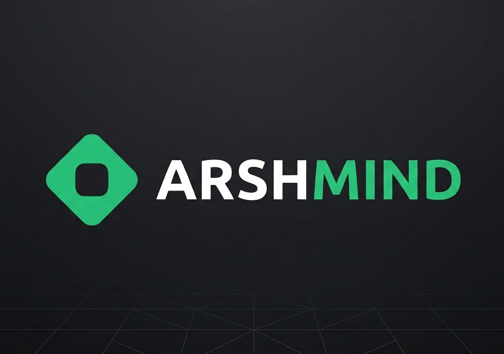

# ArshMind 


> **ArshMind** is an advanced AI-powered personal life simulation engine designed to replace linear guesswork with probabilistic future modeling. Input your career metrics, capital base, and core milestones to simulate multiple future timelines, evaluate risk profiles, and execute life decisions with absolute tactical agency.

---

## 🛠️ System Core Architecture

ArshMind processes multi-variant personal data points to synthesize interactive life matrices across different temporal horizons (3, 5, and 10-year outlooks)[cite: 1]. 

### ⚡ Key Capabilities

* **🗺️ Multi-Timeline Roadmaps:** Generates rich, multi-decade visual trajectories for career progression, liquidity accumulation, and milestone achievements based on your unique profile DNA[cite: 1].
* **🔀 Scenario Simulation:** Instantly branch trajectories into parallel timelines to observe immediate shifts in salary structural scaling, structural hazard alerts, and real compound wealth gains[cite: 1].
* **📋 Tactical Step Plans:** Deconstructs vast multi-year plans into atomic, monthly execution checklists containing targeted skill acquisition, saving parameters, and dynamic networking filters[cite: 1].
* **🧠 Context Recommendations:** Algorithmic decision alerts that track your timeline parameters, precisely flagging the ideal windows to trigger career pivots, raise capital reserves, or shift asset balances[cite: 1].
* **📊 Dynamic Control Console:** An interactive dashboard enabling you to tweak variables—such as regional growth index, compounding returns, and interest rates—and observe real-time recalculations on 10-year visual graphs[cite: 1].
* **🔒 Probabilistic Outcomes:** Replaces simple linear projection models with structural variance bands, viability indexes, and detailed risk calibration scoring[cite: 1].

---

## 🚀 Scenario Explorer: Path Vectors

The simulation engine evaluates several complex life paths categorized by risk threshold, capital commitment, and projected timeline variables[cite: 1]:

| Vector ID | Path Vector | Risk Index | 5-Yr Projected Upside | Transition Window |
| :--- | :--- | :--- | :--- | :--- |
| **PATH_01** | Upskill + Career Switch | **MEDIUM** | **EXTREME** (30-60% escalation) | 8 - 14 Months |
| **PATH_02** | Stay in Current Role | **LOW** | **BASELINE** / Predictable | Continuous |
| **PATH_03** | Launch Own Venture | **HIGH** | **UNBOUNDED** / Exponential | Variable |
| **PATH_04** | Relocate / New Market | **MEDIUM** | **HIGH** (Tax & parity adjusted) | 3 - 6 Months |
| **PATH_05** | Build Passive Income | **MEDIUM** | **COMPOUNDING** / Linear Scale | 12 - 24 Months |

### 🔍 Deep Dive: `PATH_01` (Upskill & Switch Careers Scenario Run)
* **Months 1–12:** Isolate market-disrupting skill vectors[cite: 1]. Complete targeted technical bootcamps/specializations, build proof-of-work portfolio projects, and seed critical tactical professional networks[cite: 1].
* **Years 1–2 (Transition):** Secure optimized entry-level positioning in high-growth ecosystems[cite: 1]. Experience an accelerated 30% to 60% baseline compensation spike[cite: 1].
* **Years 3–4 (Exponentiation):** Activate leadership promotion matrices[cite: 1]. Capital accumulation compounds rapidly, establishing immediate index investment leverage[cite: 1].
* **Confidence Index:** `74%` | **Path Viability Matrix Score:** `71%`[cite: 1]

---

## 🧭 Frameworks for Core Life Decisions

ArshMind provides dedicated configuration units for structural questions, evaluating multi-axis data points[cite: 1]:

1.  **CAREER (`Switch Careers vs. Deepen Expertise`):** Weighs breadth vs. depth[cite: 1]. Identifies exact inflection points indicating when to pivot versus when to extract compounding value from existing skill silos[cite: 1].
2.  **BUSINESS (`Go Solo vs. Stay Employed`):** Normalizes corporate stability against entrepreneurial upside, assessing cash flow runways to see when your profile is truly clear for launch[cite: 1].
3.  **LIFESTYLE (`Stay vs. Relocate`):** Formulates clear pre- and post-move capital mapping, taking into account tax parities, relocation dips, cost-of-living differentials, and long-term liquidity cross-overs[cite: 1].
4.  **FINANCIAL (`Optimize for Now vs. Invest for Later`):** Models the real, unmitigated cost of delaying aggressive savings and asset allocation choices by an arbitrary 1 to 3 years[cite: 1].
5.  **GROWTH (`Build Side Income vs. 100% Core Focus`):** Evaluates diversification vs. absolute deep focus, determining whether split energetic focus stabilizes your asset sheet or fractures your trajectory[cite: 1].
6.  **FREEDOM (`Grind Now vs. Prioritize Sustainable Pace`):** Pits a 10-year high-intensity sprint directly against a sustainable, burnout-resistant pace, graphing quality of life against raw asset building[cite: 1].

---

## 📋 Mission Briefing: The Execution Protocol

[01. PROFILE ALIGNMENT]
│
▼
[02. AI SCENARIO SYNTHESIS] ───► Evaluates metrics against macroeconomic and industry trends
│
▼
[03. NAVIGATE & ADJUST]     ───► Tinker with multipliers, risk inputs, and parameters live
│
▼
[04. EXECUTE STEP PLAN]     ───► Converts timelines into systematic, daily actionable benchmarks


# ArshMind 🧠

---

## ⚡ System Status & Telemetry
* **SYSTEM_CLARITY_SCORE:** `78%`[cite: 1]
* **OPERATIVES ENLISTED:** `2,400+` active nodes in deployment profile[cite: 1].
* **STABILITY RATING:** Fully stable during active Beta phase[cite: 1].
* **COMPUTE COST:** `FREE` (No in-app costs, no credit card requirements, secure encrypted directory protocol)[cite: 1].

---

## 💬 Field Reports (Operative Feedback)

> 👤 **Alex K. (Software Engineer, Age 27)**
> *"I had spent a year paralyzed under uncertainty between switching career directions or remaining static[cite: 1]. ArshMind simulated both branches flawlessly, giving me numerical clarity to trigger the transition with total safety."*[cite: 1]

> 👤 **Priya M. (Product Lead, Age 29)**
> *"Finally, an intelligence system that avoids cookie-cutter recommendations[cite: 1]. It mapped my real savings indices, calculated exact compound paths, and drafted modular tasks I track daily."*[cite: 1]

> 👤 **Sam T. (Data Analyst, Age 25)**
> *"The geographic relocation modeling was remarkable[cite: 1]. It computed the initial travel dip, accounted for tax parities, and mapped the exact cross-over month where my liquid assets surpassed my baseline."*[cite: 1]

---

## 🛠️ Development & Installation (Local Execution)

### Prerequisites
* Node.js (v18+ recommended) or Python 3.10+ (depending on your ecosystem architecture)[cite: 1]

### Local Setup
```bash
# Clone the repository to your environment
git clone [https://github.com/your-username/arshmind.git](https://github.com/your-username/arshmind.git)

# Navigate into the operational deployment directory
cd arshmind

# Install required engine configurations
npm install 

# Launch the interactive local runtime control panel
npm run dev